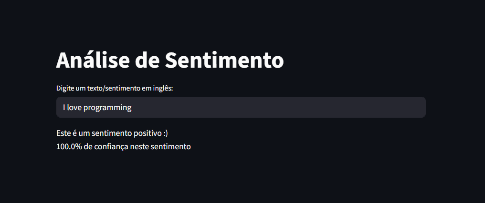

# 🎭 SentimentAnalysis

Aplicação web para análise de sentimento de textos em inglês, construída com Streamlit e DistilBERT.

---

## 📌 Sobre

O **SentimentAnalysis** é uma aplicação simples e intuitiva que utiliza um modelo de linguagem pré-treinado para identificar se um texto em inglês possui sentimento **positivo** ou **negativo**, junto com o percentual de confiança da predição.

---

## 🚀 Tecnologias utilizadas

- [Python](https://www.python.org/)
- [Streamlit](https://streamlit.io/)
- [Hugging Face Transformers](https://huggingface.co/transformers/)
- Modelo: [`distilbert-base-uncased-finetuned-sst-2-english`](https://huggingface.co/distilbert-base-uncased-finetuned-sst-2-english)

---

## 🖥️ Como rodar localmente

**1. Clone o repositório**
```bash
git clone https://github.com/seu-usuario/SentimentAnalysis.git
cd SentimentAnalysis
```

**2. Instale as dependências**
```bash
pip install -r requirements.txt
```

**3. Execute a aplicação**
```bash
streamlit run app.py
```

---

## 📦 Dependências

```
streamlit
transformers
torch
```

## 📸 Screenshot



---

## 💡 Como usar

1. Acesse a aplicação no navegador
2. Digite um texto em inglês no campo de entrada
3. Veja o resultado: **Positivo 😊** ou **Negativo 😞**, com o percentual de confiança

---

## 📄 Licença

Este projeto está sob a licença MIT.